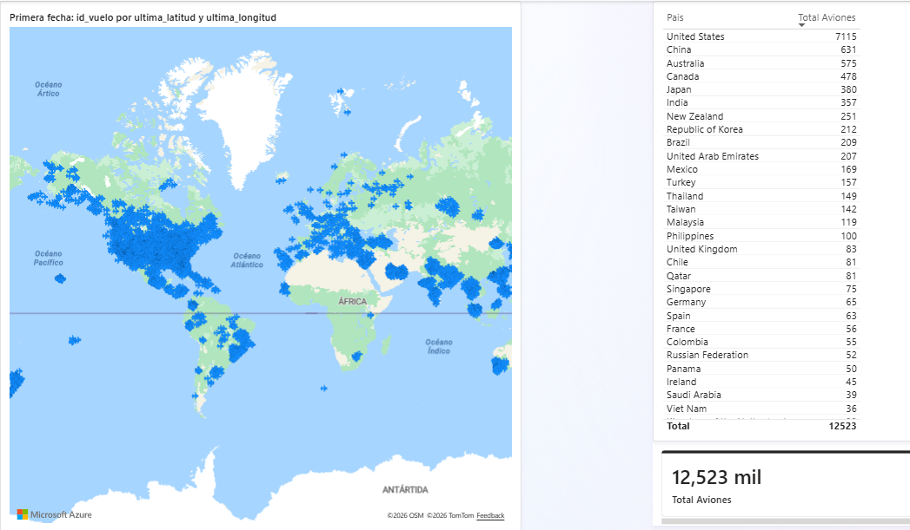

# ✈️ Global Flight Tracking Data Pipeline: Real-Time Lakehouse Architecture

## 📌 Descripción del Proyecto
Este proyecto es una arquitectura de datos End-to-End diseñada para ingerir, procesar y visualizar el tráfico aéreo mundial en tiempo real. Utilizando los principios de la **Arquitectura Medallón** (Data Lakehouse), el sistema extrae datos de vuelos en vivo, los amortigua mediante un sistema de mensajería (Streaming), los procesa y limpia de forma distribuida, y finalmente los sirve para la toma de decisiones empresariales.

Durante las pruebas de estrés, este pipeline demostró la capacidad de procesar **más de 500,000 registros** de vuelos globales en una sola ejecución sin saturación de memoria, garantizando alta disponibilidad y resiliencia.

## 🛠️ Stack Tecnológico
* **Ingestión & APIs:** Python (`requests`), OpenSky Network API.
* **Streaming & Message Broker:** Redpanda (Alternativa moderna a Apache Kafka en C++).
* **Procesamiento Big Data:** Apache Spark (PySpark).
* **Almacenamiento (Data Lake):** Sistema de archivos local (Formato Parquet).
* **Base de Datos Relacional (Serving Layer):** PostgreSQL.
* **Orquestación de Contenedores:** Docker & Docker Compose.
* **Visualización & BI:** Power BI.

## 🏗️ Arquitectura de Datos (Medallón)
El flujo de datos sigue el estándar de la industria para garantizar la calidad del dato:

1. **Extracción (Productor):** Un script de Python consulta la API en tiempo real y envía los datos crudos al clúster de Redpanda.
2. **Ingestión (Consumidor):** Los mensajes en streaming son consumidos y almacenados en el Data Lake.
3. **Capa Bronze (Raw):** Datos crudos guardados en formato Parquet, conservando el historial completo sin alteraciones.
4. **Capa Silver (Cleansed):** PySpark limpia los datos (eliminación de nulos, descarte de aviones en tierra, corrección de anomalías de sensores).
5. **Capa Gold (Business/Aggregated):** PySpark agrupa y resume los datos limpios para responder preguntas de negocio específicas.
6. **Serving Layer:** Los datos procesados se inyectan en PostgreSQL para alimentar el Dashboard interactivo.

## 📂 Estructura del Repositorio

    flight_tracking_lakehouse/
    │
    ├── data/                       # Data Lake local
    │   ├── bronze/                 # Datos crudos en formato Parquet
    │   ├── checkpoints/            # Gestión de estado para Spark Streaming
    │   ├── silver/                 # Datos limpios, filtrados y sin anomalías
    │   └── gold/                   # Datos agregados y optimizados para BI
    │
    ├── hadoop/bin/                 # Dependencias nativas (winutils) para ejecutar Spark en Windows
    │
    ├── src/
    │   ├── ingestion/
    │   │   └── fetch_flights.py    # Productor: Extrae de la API y publica en Redpanda
    │   │
    │   └── processing/
    │       ├── stream_processor.py # Consumidor: Lee de Redpanda y escribe en Bronze
    │       ├── bronze_to_silver.py # PySpark Batch: Limpieza y estandarización
    │       ├── silver_to_gold.py   # PySpark Batch: Agrupación y reglas de negocio
    │       ├── gold_to_postgres.py # Inyección de capa Gold a PostgreSQL
    │       ├── inspect_bronze.py   # Script de soporte: Análisis exploratorio
    │       └── query_silver.py     # Script de soporte: Validación de calidad de datos
    │
    ├── venv/                       # Entorno virtual aislado de Python
    ├── .env                        # Variables de entorno y credenciales (Ignorado en Git)
    ├── .gitignore                  # Reglas de exclusión para el repositorio
    ├── docker-compose.yml          # Infraestructura como Código (Redpanda, PostgreSQL)
    ├── README.md                   # Documentación principal del proyecto
    ├── requirements.txt            # Listado de dependencias y librerías de Python
    └── setup_hadoop.py             # Script de automatización de entorno

## 🚀 Instrucciones de Ejecución

### 1. Levantar la Infraestructura
En una terminal, Inicia los servicios de Redpanda y PostgreSQL mediante Docker:
docker-compose up -d

### 2. Iniciar el Flujo de Streaming
Ejecuta el productor para extraer los datos del mundo entero (se ejecutará en bucle cada 30 segundos):
python src/ingestion/fetch_flights.py

En una segunda terminal, ejecuta el consumidor para guardar el streaming en la Capa Bronze:
python src/processing/stream_processor.py

### 3. Procesamiento Batch con PySpark
Una vez recolectados los datos, ejecuta las transformaciones en orden:
python src/processing/bronze_to_silver.py
python src/processing/silver_to_gold.py

### 4. Servir a la Base de Datos
Carga la tabla final a PostgreSQL para ser consumida:
python src/processing/gold_to_postgres.py

## 📊 Insights y Resultados
Limpieza automática de datos: Se implementó lógica en PySpark capaz de filtrar anomalías, aviones estacionados y errores de transpondedor, asegurando la calidad de los datos para análisis.

Desacoplamiento efectivo: El uso de Redpanda previno cuellos de botella durante extracciones masivas, soportando la ingesta continua sin pérdida de mensajes.

Análisis de Vuelo: El modelo de datos final en Power BI permite analizar la correlación directa entre altitud y velocidad (física de vuelo) mediante el uso de identificadores únicos (id_vuelo).
